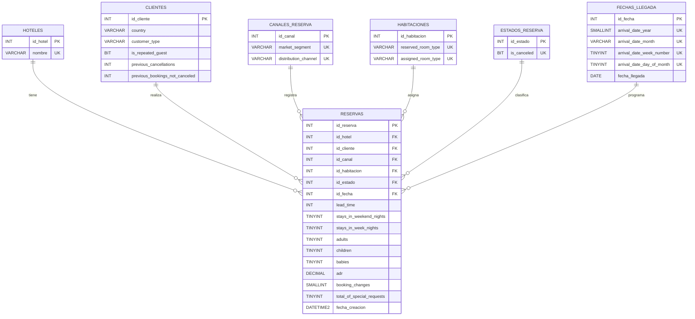

# Diagrama Entidad-Relacion

Este diagrama representa el modelo relacional usado para la implementacion de la base de datos `HotelDB` en SQL Server.

La tabla central es `Reservas`, que se conecta con las tablas de dimension del modelo: `Hoteles`, `Clientes`, `CanalesReserva`, `Habitaciones`, `EstadosReserva` y `FechasLlegada`.

## Cardinalidades

- Un hotel puede tener muchas reservas.
- Un cliente puede estar relacionado con muchas reservas.
- Un canal de reserva puede aparecer en muchas reservas.
- Una combinacion de habitacion reservada/asignada puede aparecer en muchas reservas.
- Un estado de reserva puede clasificar muchas reservas.
- Una fecha de llegada puede estar asociada a muchas reservas.
- Cada reserva pertenece a un solo registro de cada tabla relacionada.
